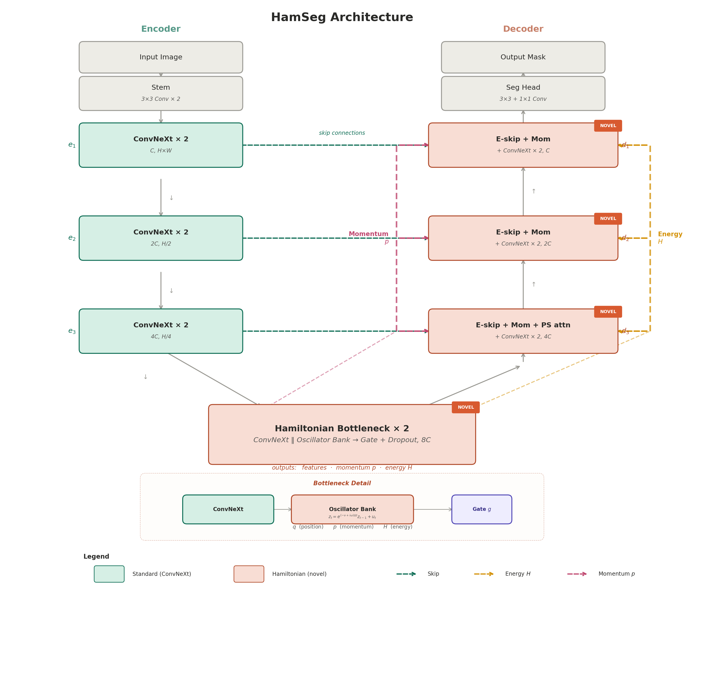
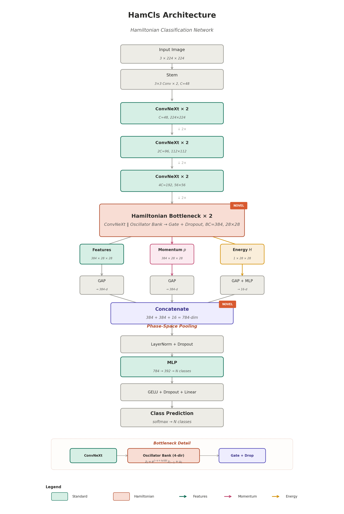

# HamVision: Hamiltonian Dynamics as Inductive Bias for Medical Image Analysis

[](paper/hamvision_paper.tex)
[](https://www.python.org/)
[](https://pytorch.org/)
[](LICENSE)

> **Hamiltonian Dynamics as Inductive Bias for Medical Image Analysis**
>
> Mohamed Mabrok — Department of Mathematics and Statistics, Qatar University

A unified framework for medical image **segmentation** and **classification** that uses the damped harmonic oscillator as a structured inductive bias. The oscillator's phase-space decomposition produces three functionally distinct representations — position (features), momentum (boundary/texture gradients), and energy (spatial saliency) — that are exploited by task-specific heads without modifying the oscillator itself.

<p align="center">
  
  
</p>
<p align="center"><em>Left: HamSeg (segmentation). Right: HamCls (classification). Both share the same encoder and Hamiltonian bottleneck.</em></p>

---

## Key Idea

The damped harmonic oscillator is a universal signal analyzer. When driven by spatially varying features, it produces:

- **Position** $q$: filtered feature content (what is present at each location)
- **Momentum** $p$: spatial gradients (large at boundaries, small in homogeneous regions)
- **Energy** $\mathcal{H} = \frac{1}{2}(q^2 + p^2)$: a parameter-free saliency map

These representations emerge from the physics — not from supervision. A bank of oscillators at different learned frequencies forms a neural filterbank, and the same bottleneck serves both segmentation and classification.

The core recurrence:

$$z_t = \underbrace{e^{-\nu_t \Delta_t}}_{\text{decay}} \cdot \underbrace{e^{i\omega \Delta_t}}_{\text{rotation}} \cdot z_{t-1} + u_t$$

where $z = q + ip$ is the complex phase-space state, $\nu_t$ is input-dependent damping, and $\omega = \sqrt{k}$ is the learned natural frequency.

---

## Results

### Segmentation

| Dataset | Modality | HamSeg | Best Baseline | Δ | Params |
|---------|----------|--------|---------------|---|--------|
| ISIC 2018 | Dermoscopy | **89.38** | 89.19 (FreqConvMamba) | +0.19 | 8.57M |
| ISIC 2017 | Dermoscopy | **88.40** | 88.37 (FreqConvMamba) | +0.03 | 8.57M |
| TN3K | Thyroid US | **87.05** | 86.85 (FreqConvMamba) | +0.20 | 8.57M |
| ACDC | Cardiac MRI | **92.40** | 89.79 (FreqConvMamba) | +2.61 | 8.57M |

### Classification (MedMNIST 224×224)

| Dataset | Modality | HamCls ACC | HamCls AUC | Best Baseline ACC |
|---------|----------|------------|------------|-------------------|
| BloodMNIST | Microscopy | **98.85** | **99.93** | 96.7 (MedMamba-X) |
| DermaMNIST | Dermoscopy | **77.96** | **93.66** | 78.0 (MedViT-S) |
| BreastMNIST | Breast US | 89.10 | 89.14 | 89.7 (MedViT-S) |

---

## Installation

```bash
git clone https://github.com/YOUR_USERNAME/hamvision.git
cd hamvision
pip install -r requirements.txt
```

### Dependencies

- Python ≥ 3.8
- PyTorch ≥ 2.0
- torchvision
- numpy, Pillow, tqdm, matplotlib
- scikit-learn (for classification metrics: AUC, F1)
- medmnist (for classification datasets, optional)

---

## Repository Structure

```
hamvision/
├── hamseg.py              # Segmentation pipeline (training + evaluation)
├── hamcls.py              # Classification pipeline (training + evaluation)
├── diagnose_hamseg.py     # Signal diagnostics (gate, momentum, energy analysis)
├── visualize_hamseg.py    # Interpretability visualizations (5 figure types)
├── preprocess_acdc.py     # ACDC NIfTI → npz preprocessor
├── requirements.txt       # Python dependencies
├── LICENSE                # MIT License
├── figs/                  # Architecture diagrams
│   ├── hamseg_architecture.png
│   └── hamcls_architecture.png
└── paper/                 # LaTeX source
    ├── hamvision_paper.tex
    ├── references.bib
    └── figs/
```

---

## Usage

### Segmentation (HamSeg)

**ISIC 2018** (dermoscopy, binary):
```bash
python hamseg.py --dataset isic2018 --data_root ./data/ISIC2018
```

**ISIC 2017** (dermoscopy, binary):
```bash
python hamseg.py --dataset isic2017 --data_root ./data/ISIC2017
```

**TN3K** (thyroid ultrasound, binary):
```bash
python hamseg.py --dataset tn3k --data_root ./data/TN3K --val_ratio 0.1
```

**ACDC** (cardiac MRI, 4-class — requires preprocessing):
```bash
# Step 1: Preprocess NIfTI to npz
python preprocess_acdc.py --acdc_root ./data/ACDC/database --output_dir ./data/ACDC_npz

# Step 2: Train
python hamseg.py --dataset acdc --data_root ./data/ACDC_npz --num_classes 4
```

**Key segmentation arguments:**
```
--dataset         Dataset name: isic2018, isic2017, tn3k, acdc
--data_root       Path to dataset folder
--num_classes     1 (binary) or N (multi-class, e.g., 4 for ACDC)
--embed_dim       Base channel width (default: 48)
--epochs          Training epochs (default: 200)
--lr              Learning rate (default: 5e-4)
--batch_size      Batch size (default: 8)
--patience        Early stopping patience (default: 80)
--val_ratio       Validation split ratio (default: 0)
--test_every      Run test evaluation every N epochs (default: 30)
```

**Expected data layout** (ISIC-style):
```
data/ISIC2018/
├── train/
│   ├── images/
│   └── masks/
└── test/
    ├── images/
    └── masks/
```

### Classification (HamCls)

**MedMNIST datasets** (auto-downloads via medmnist package):
```bash
mkdir -p ./data

# Blood cell microscopy (8 classes, 17K images)
python hamcls.py --dataset bloodmnist --size 224 --epochs 100 --batch_size 64

# Dermoscopy (7 classes, 10K images)
python hamcls.py --dataset dermamnist --size 224 --epochs 100 --batch_size 32

# Breast ultrasound (2 classes, 780 images — use balanced loss)
python hamcls.py --dataset breastmnist --size 224 --epochs 200 --batch_size 8 \
    --lr 3e-4 --weight_decay 0.01 --drop_rate 0.3 --head_drop 0.4 --balanced

# Colon pathology (9 classes, 107K images)
python hamcls.py --dataset pathmnist --size 224 --epochs 100 --batch_size 64

# Abdominal CT (11 classes, 58K images)
python hamcls.py --dataset organamnist --size 224 --epochs 100 --batch_size 64

# Retinal fundus (5 classes, 1.6K images)
python hamcls.py --dataset retinamnist --size 224 --epochs 150 --batch_size 32 --balanced

# Retinal OCT (4 classes, 109K images)
python hamcls.py --dataset octmnist --size 224 --epochs 100 --batch_size 64

# Chest X-ray (2 classes, 5.8K images)
python hamcls.py --dataset pneumoniamnist --size 224 --epochs 100 --batch_size 32
```

**Key classification arguments:**
```
--dataset         MedMNIST dataset name (e.g., bloodmnist, dermamnist)
--data_root       Path to data directory (default: ./data)
--size            Image resolution: 28, 64, 128, 224 (default: 224)
--epochs          Training epochs (default: 100)
--lr              Learning rate (default: 1e-3)
--batch_size      Batch size (default: 64)
--balanced        Use inverse-frequency class weights (for imbalanced datasets)
--test_every      Periodic test interval in epochs (default: 30)
--resume          Resume from last checkpoint
--test_only       Skip training, run test only
```

**Resuming training** (e.g., extend from 100 to 150 epochs):
```bash
python hamcls.py --dataset dermamnist --size 224 --epochs 150 --batch_size 32 --resume
```

### Diagnostics and Visualization

**Signal diagnostics** (measures gate usage, momentum by region, energy ratios):
```bash
python diagnose_hamseg.py --dataset isic2018 --data_root ./data/ISIC2018 \
    --checkpoint ./outputs/isic2018/best_model.pth
```

**Interpretability visualizations** (generates 5 figure types):
```bash
python visualize_hamseg.py --dataset isic2018 --data_root ./data/ISIC2018 \
    --checkpoint ./outputs/isic2018/best_model.pth --output_dir ./vis_output
```

Generated figures:
1. **Physics signals**: Energy map, momentum field, momentum overlay with GT
2. **Skip gate maps**: Energy-gated skip connections at all 3 decoder levels
3. **Segmentation results**: Predictions vs. ground truth with contour overlay
4. **Training curves**: Loss, Dice, learning rate over epochs
5. **Multi-scale comparison**: Side-by-side gate activations at d₃, d₂, d₁

---

## Architecture

### Shared Components (both tasks)

| Component | Details |
|-----------|---------|
| Stem | 3×3 Conv × 2, C=48 |
| Encoder | 3 stages of ConvNeXt blocks (C → 2C → 4C → 8C) |
| Bottleneck | ConvNeXt ‖ Oscillator Bank → Gated Fusion + Dropout |

### HamSeg (Segmentation) — 8.57M params

The decoder uses energy-gated skip connections (energy map modulates encoder features via centered sigmoid) and momentum injection (projected momentum concatenated at every decoder level) plus phase-space attention at the coarsest decoder level.

### HamCls (Classification) — 7.3M params

Phase-space pooling aggregates the three oscillator outputs:
- Features → GAP → 384-d (content)
- Momentum → GAP → 384-d (texture/boundary complexity)
- Energy → GAP + MLP → 16-d (saliency statistics)
- Concatenate (784-d) → LayerNorm → MLP → class logits

---

## Output Structure

Each training run creates a self-contained output folder:

```
outputs/isic2018/                   # Segmentation
├── best_model.pth                  # Best model weights
├── last_checkpoint.pth             # Full checkpoint (optimizer, scheduler)
├── report.txt                      # Comprehensive results report
├── test_results_final.json         # Final test metrics
├── test_results_epoch030.json      # Periodic test at epoch 30
├── test_results_epoch060.json      # Periodic test at epoch 60
├── training_curves.png             # Loss/Dice/LR plots
└── train.log                       # Full training log

outputs_hamcls/bloodmnist/          # Classification
├── best_model.pth
├── last_checkpoint.pth
├── report.txt                      # ACC, AUC, F1, per-class breakdown
├── test_results_final.json
├── test_results_epoch030.json
├── training_curves.png
├── history.json                    # Full training history
└── train.log
```

---

## Metrics

### Segmentation
- **DSC** (Dice Similarity Coefficient)
- **mIoU** (mean Intersection over Union)
- **Precision**, **Specificity**, **Accuracy**

### Classification
- **ACC** (Top-1 Accuracy)
- **AUC** (macro, one-vs-rest)
- **F1** (macro and weighted)
- Per-class accuracy and F1
- Confusion matrix
- Full sklearn classification report

---

## Interpretability

The Hamiltonian formulation provides built-in interpretability without post-hoc methods:

| Signal | Physical Meaning | Segmentation Use | Classification Use |
|--------|-----------------|------------------|-------------------|
| Position $q$ | Filtered features | Decoder input | Content pooling |
| Momentum $p$ | Spatial gradients | Boundary injection | Texture complexity |
| Energy $\mathcal{H}$ | Saliency map | Skip gate modulation | Excitation statistics |

Diagnostic analysis confirms:
- **Gate usage**: Oscillator contributes ~80% in block 0, ~59% in block 1
- **Momentum gradient**: Interior (110.2) > Boundary (95.1) > Exterior (83.2)
- **Energy ratio**: Boundary/Exterior = 1.25×
- **Skip gates**: Full dynamic range [0.19, 0.75] at all decoder levels

---

## Citation

```bibtex
@article{mabrok2026hamvision,
  title   = {Hamiltonian Dynamics as Inductive Bias for Medical Image Analysis},
  author  = {Mabrok, Mohamed},
  journal = {arXiv preprint},
  year    = {2026}
}
```

## Related Work

- **SymMamba**: Hamiltonian oscillator dynamics for language modeling ([paper](https://arxiv.org/abs/XXXX))
- **Mamba-3**: Complex-valued SSMs with exponential-trapezoidal discretization ([paper](https://arxiv.org/abs/2603.15569))

---

## License

This project is released under the [MIT License](LICENSE).
